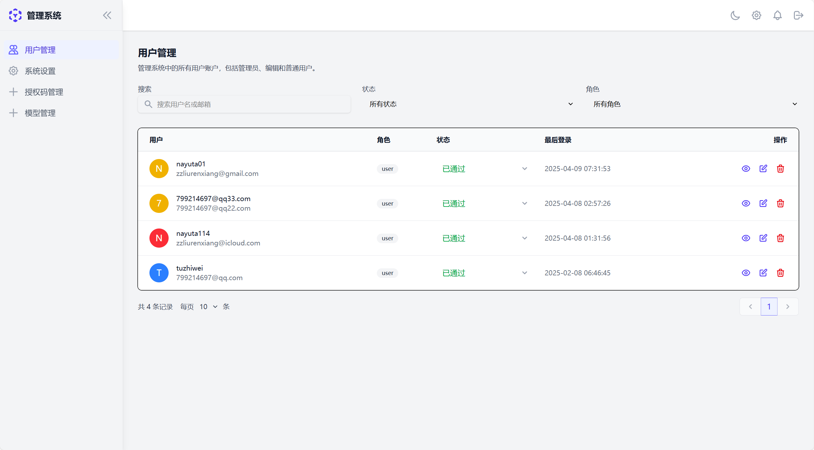

# 后台管理系统

## 用户管理

管理员可以在该界面管理系统中的所有用户。
### 功能概述

用户管理界面提供以下功能：
- 查看所有用户信息
- 搜索用户
- 编辑用户信息
- 删除用户
- 批量操作

### 核心概念
- **用户**：系统中的用户账户，包括用户名、邮箱、角色等信息。
- **角色**：用户在系统中的权限级别，包括管理员、普通用户等。

### 高级功能
- **搜索功能**：根据用户名、邮箱，用户状态，用户角色等条件进行用户搜索。
- **批量操作**：支持批量编辑、删除用户。

