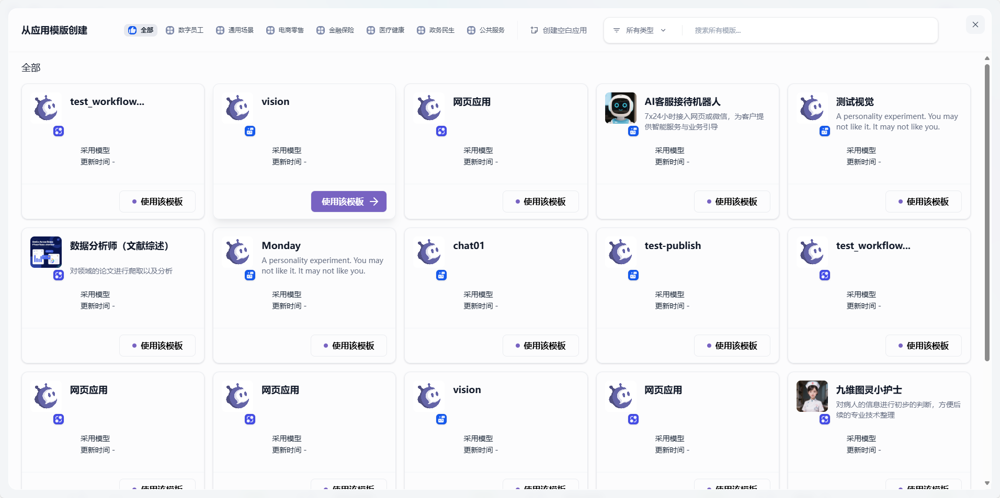

# 创建应用

在 GoAgent 的工作室内，你可以通过以下 2 种方式创建应用：
- 基于应用模板创建（新手推荐）
- 创建一个空白应用

## 从模板创建应用
初次使用 GoAgent 时，你可能对应用创建不太熟悉。为帮助新手用户快速了解在 GoAgent 上能构建的应用类型，GoAgent 团队的提示词工程师已创建好多场景、高质量的应用模板。

操作步骤如下：
1. 从导航选择「工作坊」。
2. 在应用列表内选择「从应用模板创建」。

3. 任意选择某个模板，并将其添加至工作区。

## 创建一个新应用
若你需要在 GoAgent 上创建一个空白应用，可按以下步骤操作：
1. 从导航选择「工作室」。
2. 在应用列表内选择「从空白创建」。

在 GoAgent 上可以创建 2 种不同的应用类型，分别是聊天助手和工作流。

创建应用时，你需要完成以下设置：
- 给应用起一个名字。
- 选择合适的图标，或者上传喜爱的图片用作图标。
- 使用一段清晰的文字描述此应用的用途，以便后续应用在团队内的使用。

