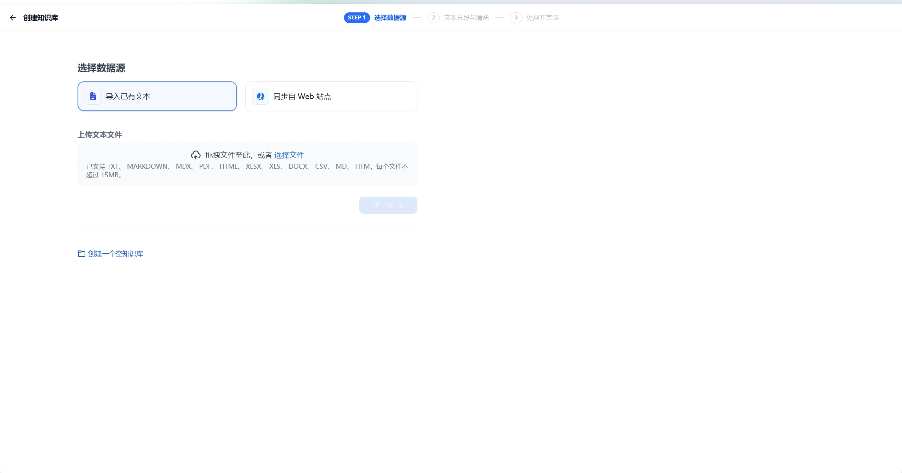
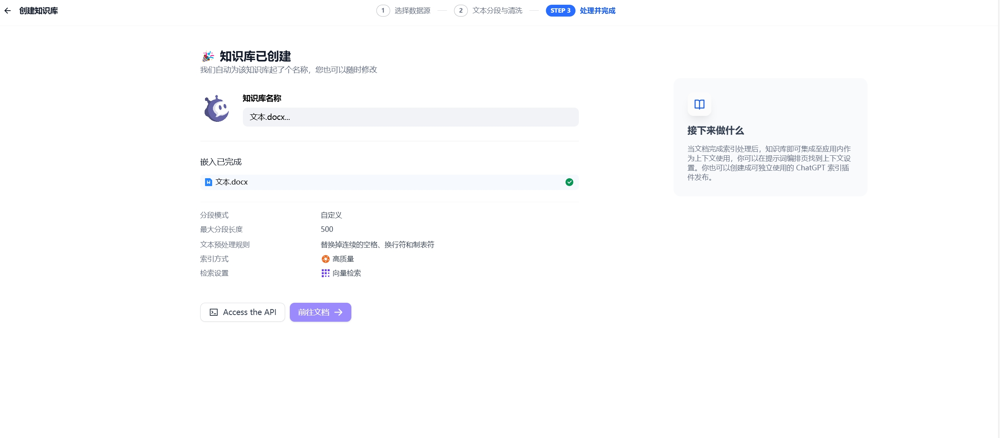

# 创建知识库

在 GoAgent 中创建知识库并上传文档，大致可按以下步骤进行：

## 1. 创建知识库
你可以选择上传本地文件、导入在线数据，或者直接创建一个空的知识库。

## 2. 指定分段模式
此阶段是对内容进行预处理和数据结构化的过程。长文本会被划分为多个内容分段，你可以在此环节预览文本的分段效果。
- 详细信息可查看 [chunking-and-cleaning-text.md](chunking-and-cleaning-text.md)。

## 3. 设定索引方法和检索设置
当知识库接收到用户的查询问题后，会按照预设的检索方式在已有的文档内查找相关内容，提取出高度相关的信息片段，以供语言模型生成高质量答案。
- 有关设置索引方法的具体内容，可参考 [setting-indexing-methods.md](setting-indexing-methods.md)。

## 4. 等待分段嵌入
完成上述设置后，等待系统对内容进行分段嵌入处理。

## 5. 完成上传并关联使用
上传完成后，你可以在应用内关联知识库并使用。可搭建出能够基于知识库进行问答的 LLM 应用。

