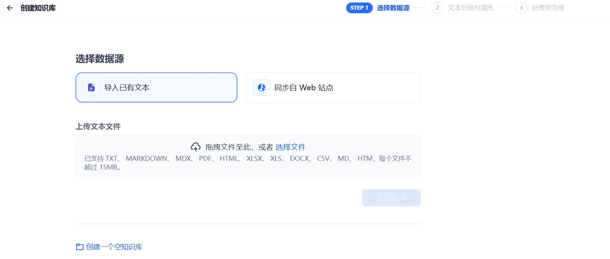
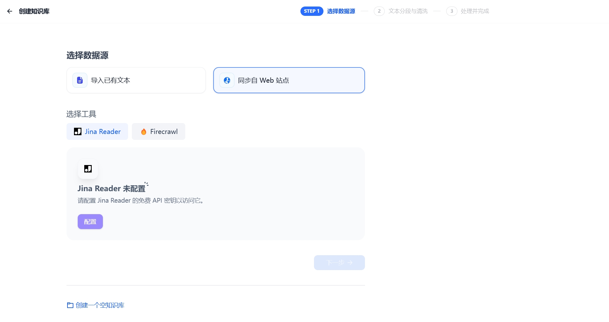
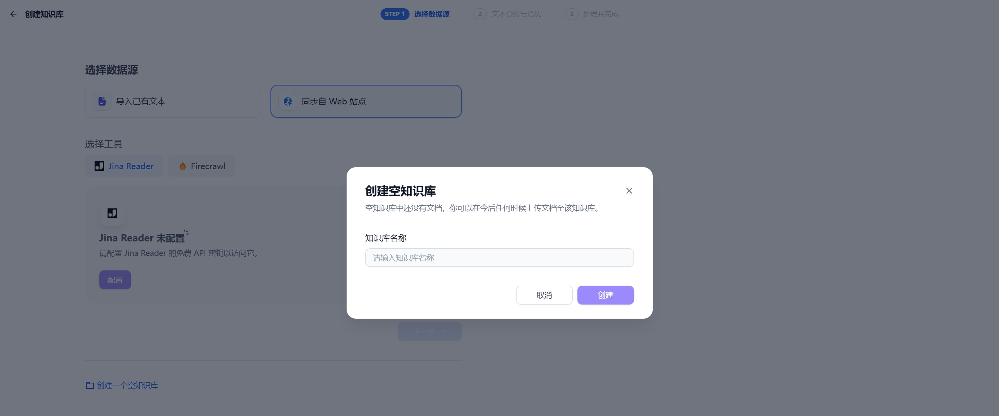

# 1. 导入文本数据

在 GoAgent 平台中，你可以轻松创建知识库并上传文档。具体操作如下：轻点平台顶部导航中的 **“知识库”**，然后选择 **“创建知识库”**。你有两种方式可以将文档上传至知识库：上传本地文件或导入在线数据。

## 上传本地文件
你可以通过拖拽文件或者手动选中文件的方式进行上传，并且支持批量上传。

## 导入在线数据
创建知识库时，你也可以选择通过在线数据导入。目前，知识库支持导入以下这种在线数据：

需要注意的是，引用在线数据的知识库后续无法新增本地文档，也不能变更为本地文件类型的知识库。这是为了避免单一知识库存在多种数据来源，从而造成管理困难。

## 后续导入
如果你还没有准备好文档或其他内容数据，也不用担心。你可以先创建一个空知识库，后续再上传本地文档或导入在线数据。

