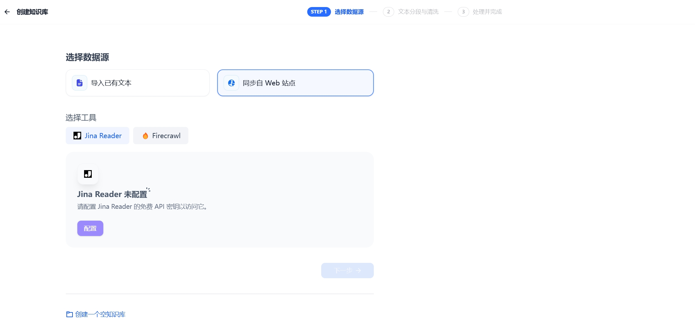
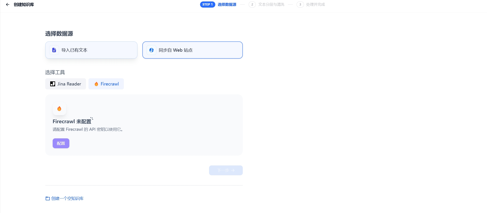

# 1.2 从网页导入数据

GoAgent 知识库支持借助第三方工具，如 [Jina Reader](https://jina.ai/reader) 和 [Firecrawl](https://www.firecrawl.dev/)，抓取公开网页内容，解析为 Markdown 格式后导入知识库。

> Jina Reader 和 Firecrawl 均为开源网页解析工具，能将网页内容转换为简洁且便于大语言模型（LLM）识别的 Markdown 文本，同时提供易用的 API 服务。

下面分别介绍 Firecrawl 和 Jina Reader 的使用方法。

## Firecrawl
### 配置 Firecrawl 凭据
1. 进入 **选择数据源** 页面。
2. 点击 Firecrawl 下方的 配置 按钮。

3. 登录 [Firecrawl 官网](https://www.firecrawl.dev/) 完成注册，获取 API Key 后按页面提示填入并保存。

## Jina Reader
### 配置 Jina Reader 凭据
1. 前往 **选择数据源** 页面。
2. 点击 Jina Reader 下方的 Configure 按钮。

3. 登录 [Jina Reader 官网](https://jina.ai/reader) 完成注册，获取 API Key 后按页面提示填入并保存。

