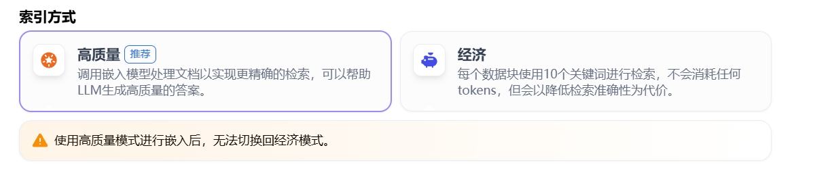

# 设定索引方法与检索设置

选定内容的分段模式后，接下来要为结构化内容设定**索引方法**与**检索设置**。

## 设定索引方法

如同搜索引擎借助高效索引算法匹配与用户问题最相关的网页内容，合理的索引方式对 LLM 检索知识库内容的效率和回答的准确性起着直接影响。

系统提供“高质量”与“经济”两种索引方法，每种方法都有不同的检索设置选项。

### 高质量模式
- **原理**：使用 Embedding 嵌入模型将已分段的文本块转换为数字向量，能更有效地压缩与存储大量文本信息，让用户问题与文本的匹配更加精准。
- **检索设置**：内容块向量化并录入数据库后，需通过有效的检索方式调取匹配内容块。
- **模式限制**：选择高质量模式后，当前知识库的索引方式无法降级为“经济”索引模式。如需切换，建议重新创建知识库并重选索引方式。
- **图示**：

### 经济模式
- **原理**：在经济模式下，每个区块内使用 10 个关键词进行检索，降低了准确度但无需产生费用。对于检索到的区块，仅提供倒排索引方式选择最相关的区块。
- **模式调整**：选择经济型索引方式后，若感觉实际效果不佳，可以在知识库设置页中升级为“高质量”索引方式。
- **图示**：

