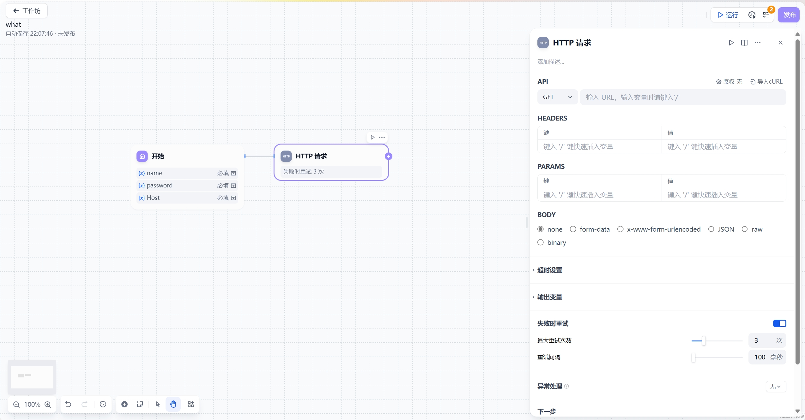

# HTTP 请求

## 功能概述

HTTP请求节点允许通过标准HTTP协议与外部服务交互，支持多种请求方法和数据格式，实现以下功能：
- 获取外部API数据
- 发送Webhook通知
- 文件上传/下载
- 与第三方服务集成

## 支持的请求方法

| 方法 | 用途 | 典型场景 |
|------|------|----------|
| GET | 获取资源 | 数据查询、信息检索 |
| POST | 提交数据 | 表单提交、API调用 |
| PUT | 上传/更新资源 | 文件上传、数据更新 |
| DELETE | 删除资源 | 数据清除 |
| HEAD | 获取响应头 | 服务可用性检查 |
| PATCH | 部分更新 | 数据字段修改 |

## 详细配置指南

### 基础配置
1. **请求配置**
   - URL地址
   - 请求方法选择
   - 请求头设置
   - 查询参数

2. **请求体内容**
   - 表单数据
   - JSON/XML格式
   - 二进制文件上传

### 响应处理
- 状态码检查
- 响应体解析
- 文件下载保存
- 响应头分析

## 高级功能

### 错误处理机制
1. **自动重试**
   - 最大重试次数：10次
   - 重试间隔：最大5000ms

2. **异常处理**
   - 自定义错误处理流程
   - 备用方案配置

### 变量支持
- 动态插入请求参数
- 响应数据变量化
- 文件内容传递

## 最佳实践案例

### 文件同步方案
1. 接收用户上传文件
2. 通过HTTP节点传输
3. 第三方服务处理
4. 返回处理结果

### API数据获取
1. 构造请求参数
2. 发送GET请求
3. 解析JSON响应
4. 后续流程处理

## 注意事项
1. 注意API调用频率限制
2. 敏感数据需加密传输
3. 大文件传输考虑超时设置
4. 建议启用错误重试机制
