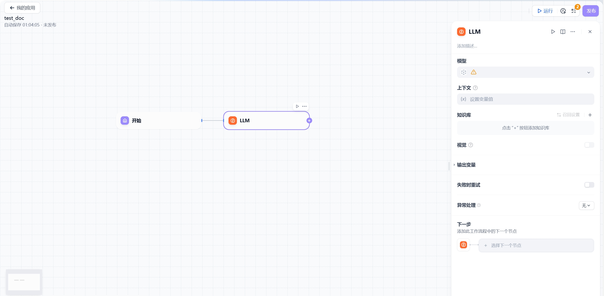
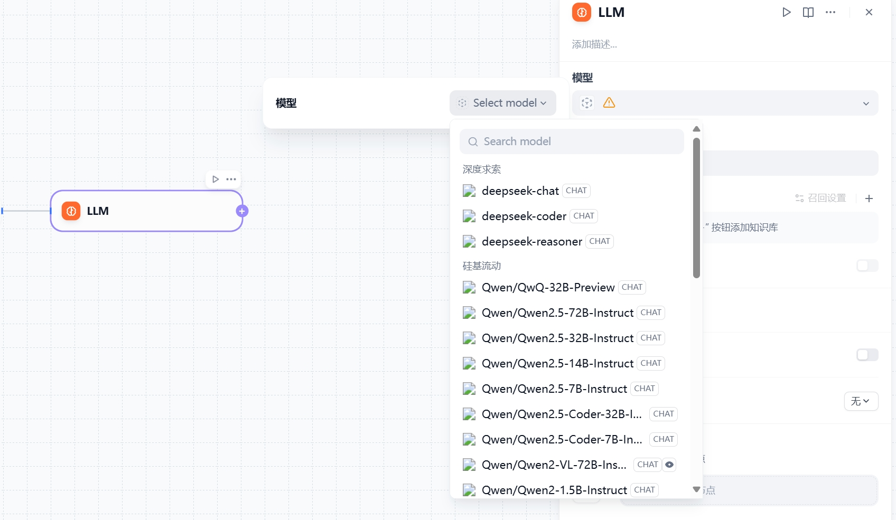
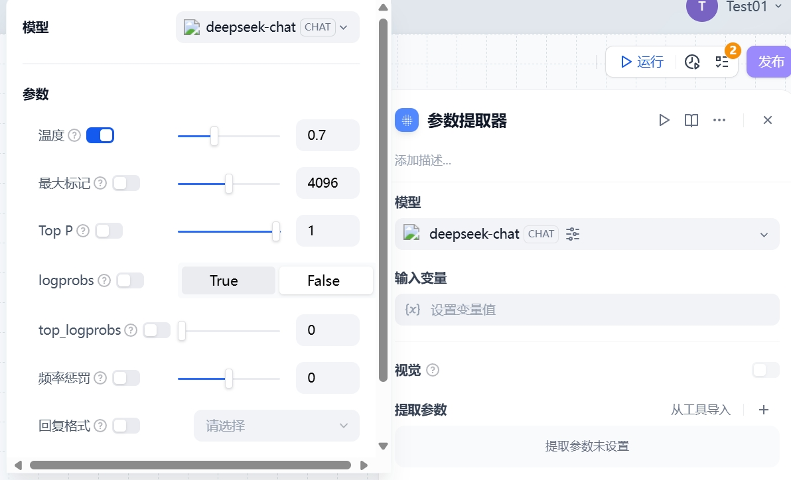
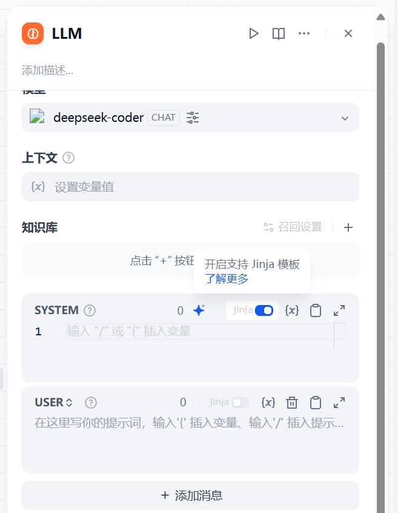
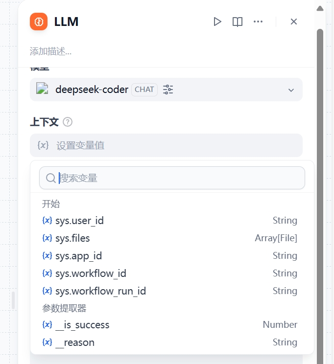
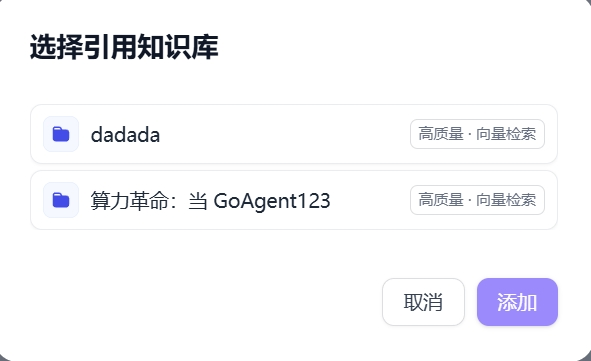
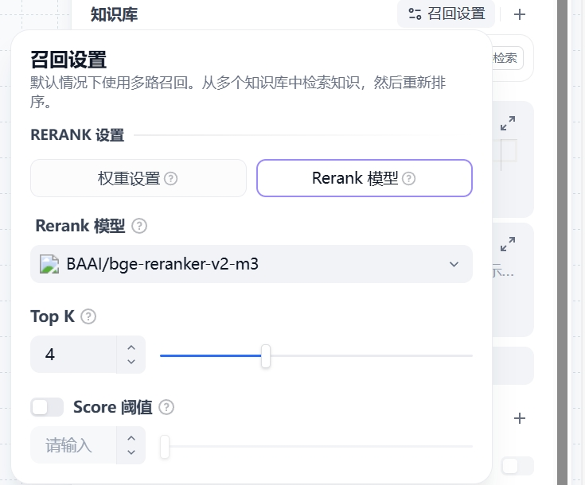
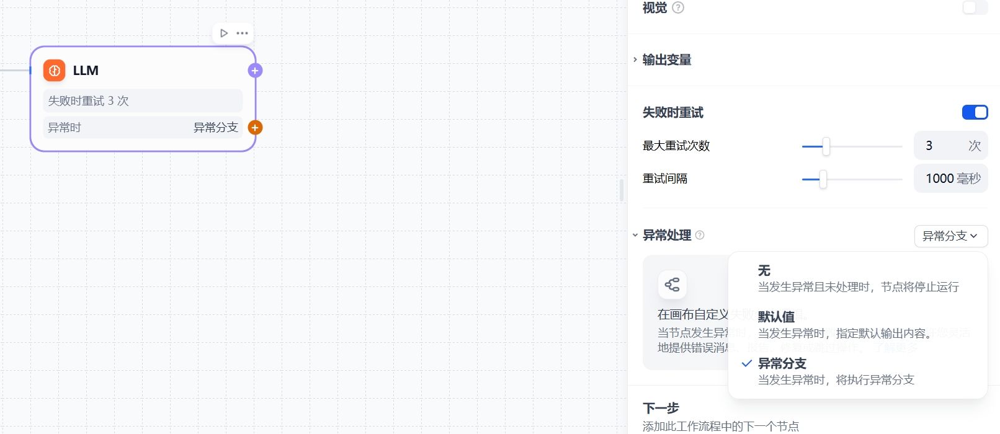

# LLM

## 核心功能概述

LLM节点是GoAgent工作流中的核心处理单元，通过调用大语言模型处理多种输入类型：
- 自然语言文本
- 上传的文件
- 图片内容

## 应用场景详解

### 典型应用场景

1. **智能对话处理**
   - 客服场景的意图识别与分类
   - 多轮对话上下文管理

2. **内容生成与转换**
   - 根据主题生成文章内容
   - 文本翻译与语言转换
   - 邮件自动分类（咨询/投诉/垃圾邮件）

3. **编程辅助**
   - 业务代码生成
   - 测试用例编写

4. **知识处理**
   - 知识库问答(RAG)
   - 文档内容分析与摘要

5. **多媒体理解**
   - 图片内容解析
   - 文件内容提取与分析

## 详细配置指南

### 节点添加与基础配置

1. **添加LLM节点**
   - 右键点击工作流画布
   - 或点击上一节点末尾的"+"按钮

2. **模型选择**
   - 支持主流模型：DeepSeek,Qwen等系列
   - 选择依据：任务需求、成本、响应速度等

注意：首次使用需在"系统设置 > 模型供应商"中完成配置

### 模型参数配置

关键参数说明：
- **温度(Temperature)**：控制输出随机性(0-1)
- **Top P**：控制结果多样性
- **存在惩罚**：减少内容重复
- **频率惩罚**：增加词汇多样性

### 提示词配置

提示词编写功能：
- 系统/用户/助手角色提示词定义
- 提示词生成器辅助创作
- 变量插入功能（"/"或"{"触发）

## 高级功能配置

### 特殊变量使用

1. **上下文变量**
   - 提供背景信息
   - 知识库检索结果传递

2. **知识库设置**
   - 知识库检索
   - 自定义知识库支持

3. **会话历史**
   - 对话上下文记录
   - 增强对话连贯性

### 高级设置选项

1. **记忆功能**
   - 对话历史记录开关
   - 记忆窗口大小设置

2. **模板引擎**
   - Jinja2模板支持
   - 复杂逻辑实现

3. **错误处理**
   - 自动重试机制
   - 自定义重试策略
   - 异常处理流程

