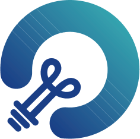

# 直接回复
### 定义

定义一个 GoModel 流程中的回复内容。

你可以在文本编辑器中自由定义回复格式，包括自定义一段固定的文本内容、使用前置步骤中的输出变量作为回复内容、或者将自定义文本与变量组合后回复。

可随时加入节点将内容流式输出至对话回复，支持所见即所得配置模式并支持图文混排，如：

1. 输出 LLM 节点回复内容
2. 输出生成图片
3. 输出纯文本

**示例1：** 输出纯文本

<figure>
  
  <figcaption>这里需要一张展示输出纯文本示例的图片</figcaption>
</figure>

**示例2：** 输出图片+LLM回复

<figure>
  
  <figcaption>这里需要一张展示输出图片和LLM回复示例的图片</figcaption>
</figure>

<figure>
  
  <figcaption>这里需要一张展示输出图片和LLM回复的另一示例图片，宽度为275px</figcaption>
</figure>


直接回复节点可以不作为最终的输出节点，作为流程过程节点时，可以在中间步骤流式输出结果。

