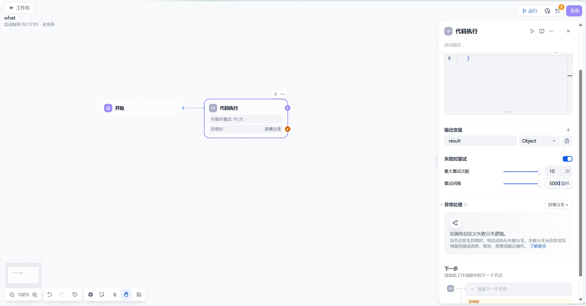

# 代码执行

## 功能介绍

代码节点支持运行Python/NodeJS代码以在工作流程中执行数据转换。它可以简化工作流程，适用于：
- 数学计算
- 文本处理等场景
该节点使开发者能够嵌入自定义脚本，以预设节点无法达到的方式操作变量。


## 配置说明
配置步骤：
1. 在'输入变量'中定义变量名
2. 引用其他节点的变量
3. 编写处理代码
4. 声明输出变量

注意事项：
- 必须明确定义输入输出变量
- 输出变量需在代码中返回字典
- 可引用工作流中的任何上游变量

## 使用场景

### 数学计算示例
```python
def calculate_variance(num: int) -> dict:
    return {
        'result': num ** 2
    }
```


## 高级功能
### 错误重试配置
- 最大重试次数: 10次
- 最大重试间隔: 5000ms
- 指数退避策略



#### 异常处理流程
1. 启用异常处理功能
2. 配置备用处理方案
3. 设置错误返回内容
4. 可选择继续或终止流程


