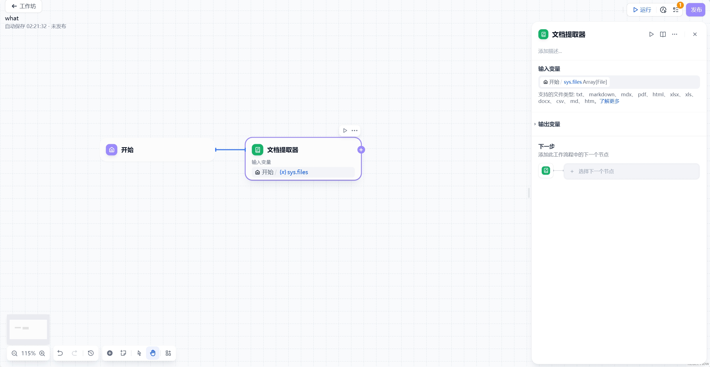

# 文档提取器

## 核心功能
文档提取器是GoModel工作流中处理文件内容的核心组件，负责将各类文档转换为LLM可处理的文本格式。

### 工作原理
1. **文件解析**：自动识别上传文档的格式类型
2. **内容提取**：准确提取文档中的文字内容
3. **格式转换**：输出标准化的文本数据

注意：LLM引擎无法直接处理原始文件，必须通过文档提取器进行格式转换

## 适用场景
- 文档问答系统（如PDF/Word文件咨询）
- 多文件内容分析比对
- 自动化文档内容检查

## 节点结构

**图片位置：节点结构示意图**

### 输入配置
| 输入类型       | 说明                  | 典型应用场景      |
|----------------|-----------------------|-------------------|
| 单个文件(File) | 处理单个文档          | 单文件问答系统    |
| 文件数组       | 批量处理多个文档      | 多文档对比分析    |

支持格式：TXT、Markdown、PDF、DOCX、HTML  
不支持格式：图片、音频、视频等二进制文件

### 输出结果
- 单文件输入：输出字符串(text)
- 多文件输入：输出字符串数组(text[])

