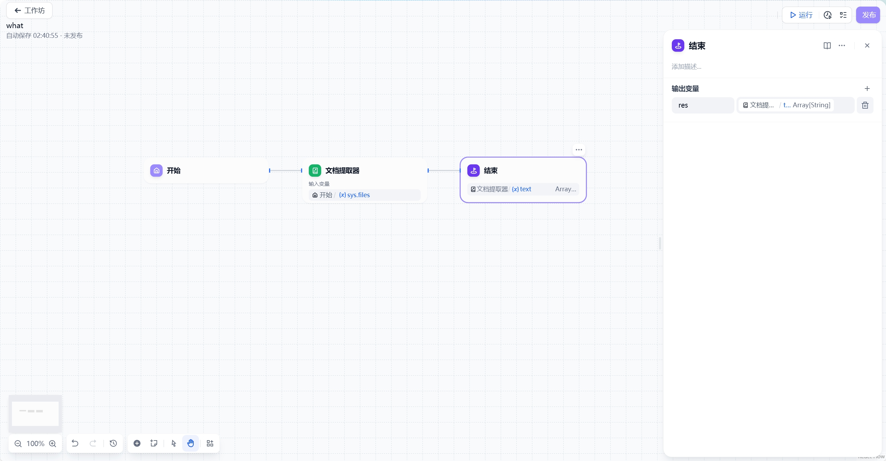

# 结束

## 定义

定义工作流程终止时的最终输出内容。每个工作流执行完成后必须包含至少一个结束节点，作为流程终止点并输出最终执行结果。

结束节点是工作流的终止节点，后续不可再连接其他节点。GoAgent工作流引擎只有在运行到结束节点时才会输出执行结果。当流程中存在条件分支时，需要为每个分支路径配置相应的结束节点。

结束节点需要声明一个或多个输出变量，这些变量可以引用所有上游节点的输出数据。

## 使用场景

### 单路径执行示例：
**图片位置：单路径输出示例图**

### 多分支执行示例：
**图片位置：多分支输出示例图**

