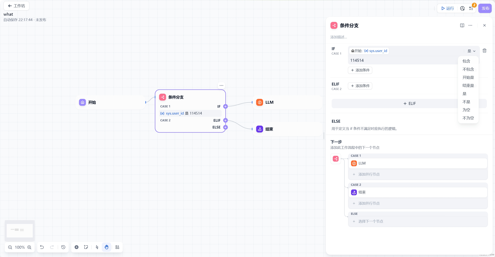

# 条件分支

## 功能概述

条件分支节点允许您根据预设条件将工作流拆分为多个执行路径，实现基于不同条件的流程控制。

## 核心功能

### 分支执行机制
- **IF条件**：设置变量判断条件
  - 条件成立(`True`) → 执行IF路径
  - 条件不成立(`False`) → 执行ELSE路径或继续判断ELIF条件
- **ELIF条件**：设置次级判断条件
  - 条件成立 → 执行对应ELIF路径
  - 条件不成立 → 继续判断后续条件

### 支持的条件类型
1. 包含(Contains)
2. 不包含(Not contains)  
3. 开始是(Start with)
4. 结束是(End with) 
5. 是(Is)
6. 不是(Is not)
7. 为空(Is empty)
8. 不为空(Is not empty)

## 最佳实践建议

1. 优先处理最可能发生的条件
2. 合理使用ELIF减少不必要的条件判断
3. 为所有可能情况设置ELSE默认路径
4. 复杂逻辑建议拆分为多个简单条件