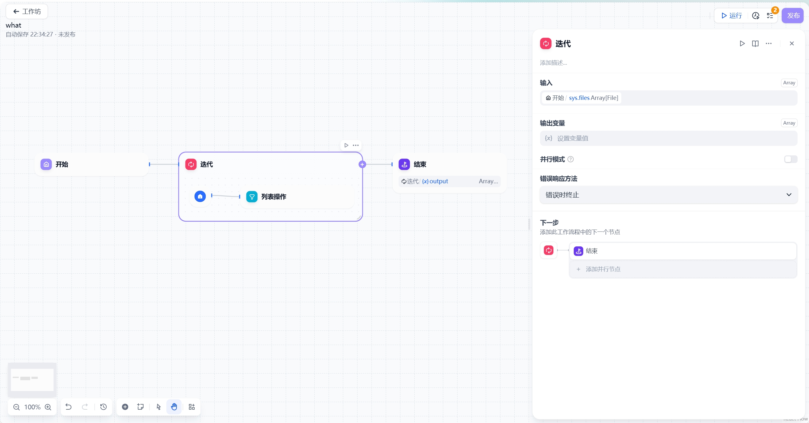
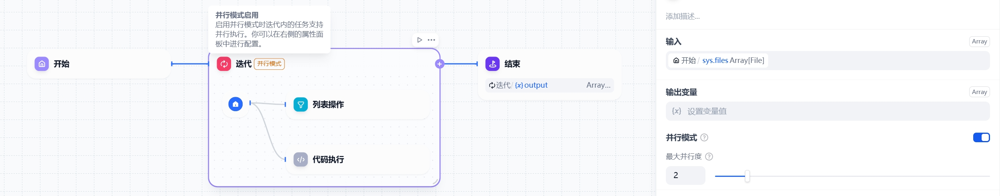
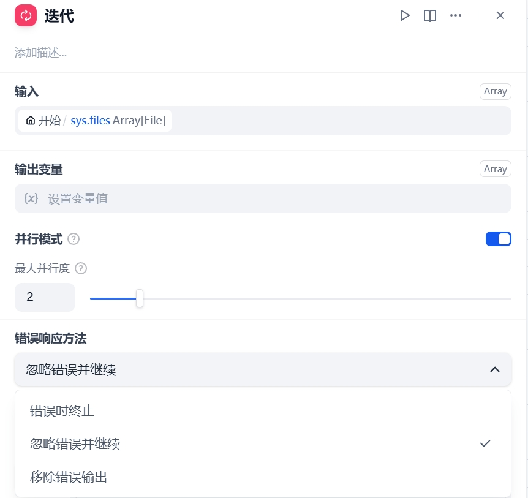

# 迭代

## 功能概述

迭代节点是GoAgent中的批处理组件，能够对数组元素依次执行相同操作流程。主要解决以下问题：
- 处理超长内容时突破单次对话限制
- 批量执行相同处理流程
- 自动化分步任务处理

> **典型应用场景**：长文本分片处理、批量数据转换、分步骤内容生成

## 核心概念

### 工作原理

包含三个核心单元：
1. **输入变量**：仅接受Array类型数据
2. **迭代工作流**：可编排多个处理节点
3. **输出变量**：始终输出Array类型结果

## 高级功能

### 并行模式

### 错误处理策略

- 立即终止
- 忽略继续（保留null值）
- 移除错误（仅保留成功结果）

