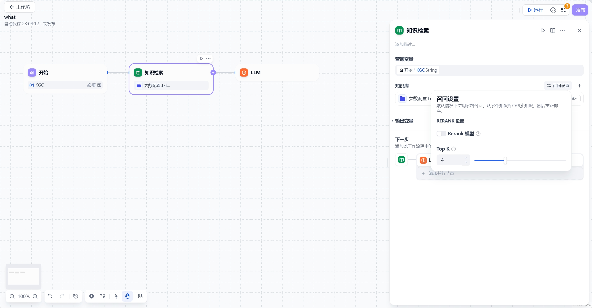

# 知识检索

### 定义

从知识库中检索与用户问题相关的文本内容，可作为下游 LLM 节点的上下文使用。

***

### 应用场景

下图为一个最基础的知识库问答应用示例，该流程的执行逻辑为：

1. 知识库检索作为 LLM 节点的前置步骤
2. 匹配用户问题最相关的文本内容并召回
3. 将用户问题与检索到的上下文一同作为 LLM 输入

***

### 配置指引

**配置流程：**

1. **选择查询变量**  

   - 通常使用 `sys.query` 作为查询变量
   - 最大支持 200 字符的查询内容

   

2. **选择知识库**  
   - 需预先在 GoAgent 中[创建知识库](../../knowledge-base/create-knowledge-and-upload-documents/README.md)

3**设置召回模式**  
   - 默认采用多路召回机制
   - 支持自定义召回策略

4**连接下游节点**  
   - 通常连接至 LLM 节点

