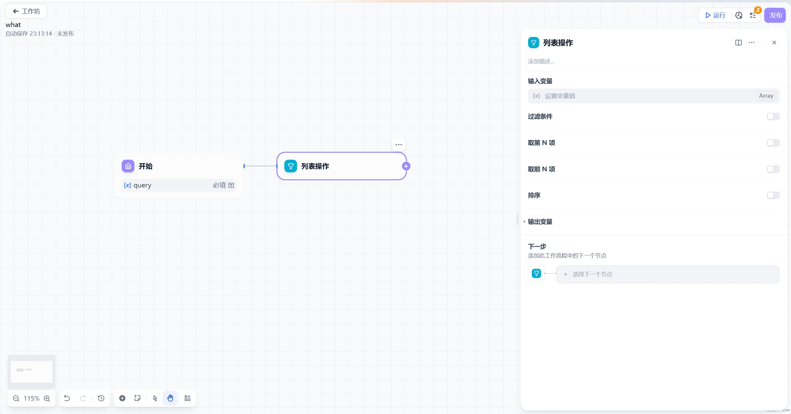
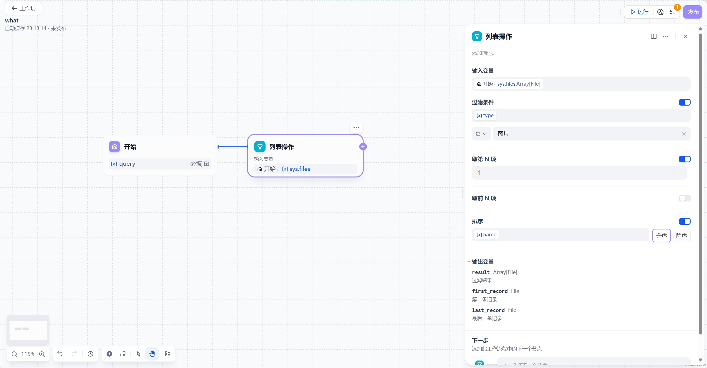

# 列表操作

## 功能概述

列表操作节点用于处理多文件上传场景，解决以下核心问题：
- 分离混合文件类型（文档/图片/音频/视频）
- 提取特定条件的文件
- 为下游节点提供标准化输入

## 核心功能

### 文件处理能力
1. **类型分离**：自动分类不同格式文件
2. **属性过滤**：按类型/大小/名称等条件筛选
3. **排序输出**：支持多种排序方式

### 支持的数据类型
- Array[string]
- Array[number] 
- Array[file]

## 详细配置指南

### 输入配置
- 接收上游数组变量
- 支持文件/字符串/数字数组

### 过滤条件设置
| 过滤字段 | 说明 | 示例 |
|---------|------|------|
| type | 文件类型 | image/png |
| size | 文件大小(KB) | >1024 |
| name | 文件名 | *.pdf |
| extension | 文件扩展名 | .docx |
| mime_type | MIME类型 | application/pdf |

### 排序选项
1. **升序排列**（A-Z/小到大）
2. **降序排列**（Z-A/大到小）

### 输出配置
- **result**：过滤结果数组
- **first_record**：首元素
- **last_record**：末元素

