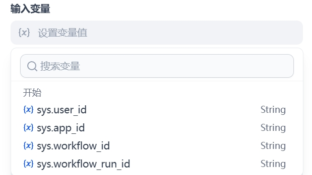
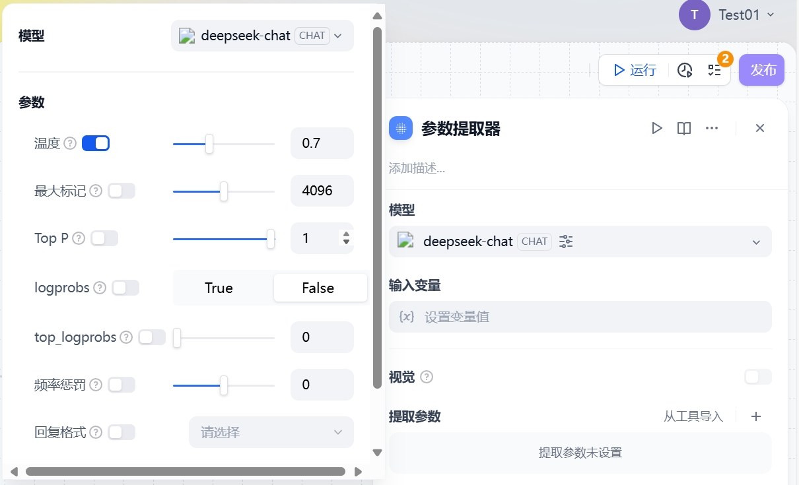
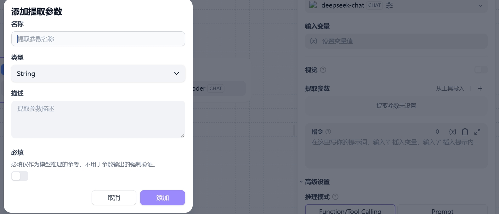
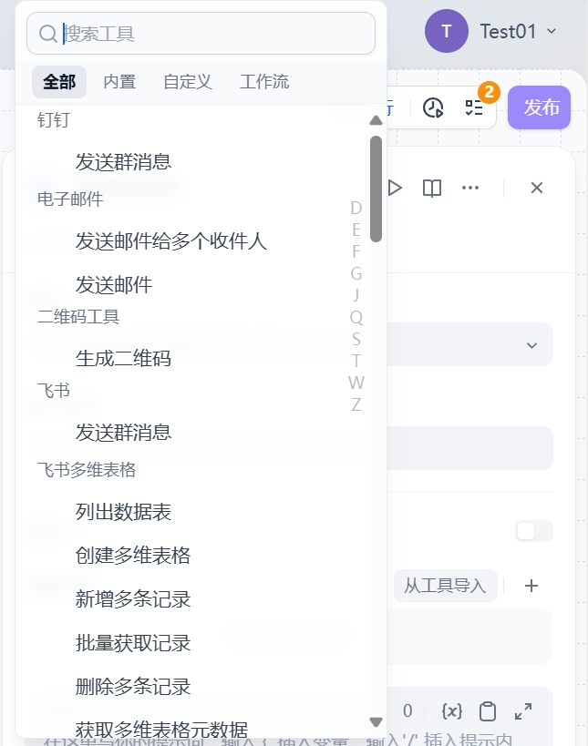
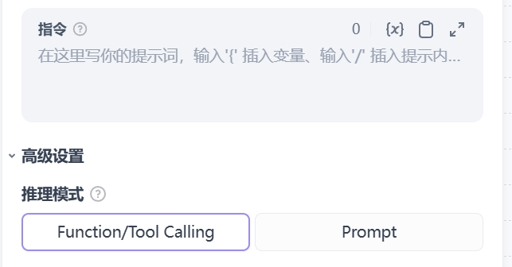
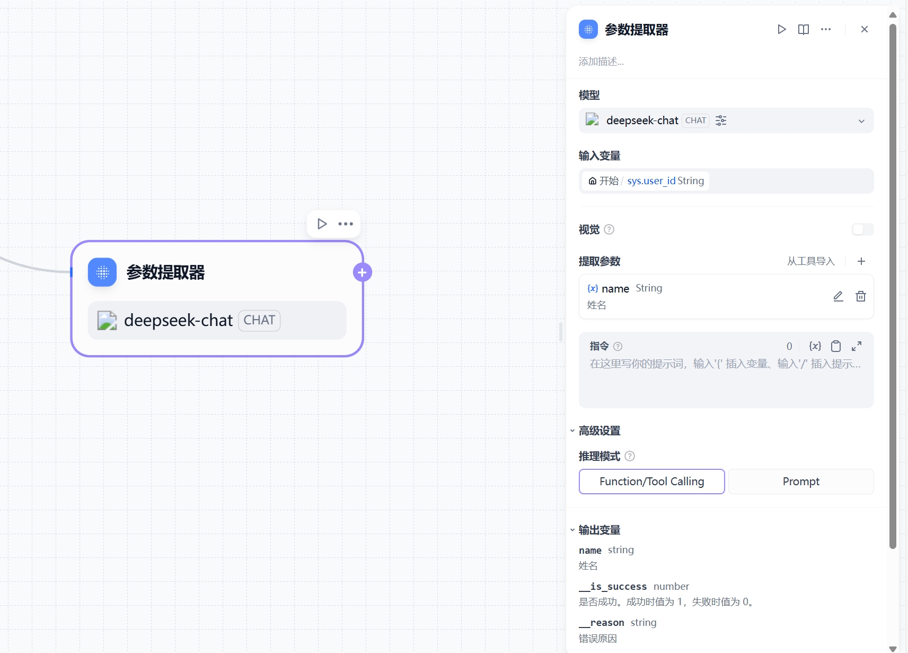

# 参数提取

## 定义

参数提取功能利用大语言模型(LLM)从自然语言中推理并提取结构化参数，主要用于以下场景：

- 为工具调用提供结构化输入参数
- 为HTTP请求准备参数数据

## 配置指南

### 基础配置

1. **输入变量**：选择用于参数提取的变量（支持文件类型）
   

2. **模型选择**：选择用于参数提取的LLM模型
   

3. **参数定义**：
    - 手动添加需要提取的参数
      
    - 支持从已有工具中快捷导入
      

4. **指令编写**：复杂参数提取时可提供示例提升效果
   

5. **高级功能设置**：
   推理模式可选Function/Tool Calling或Prompt
   

### 完整界面

