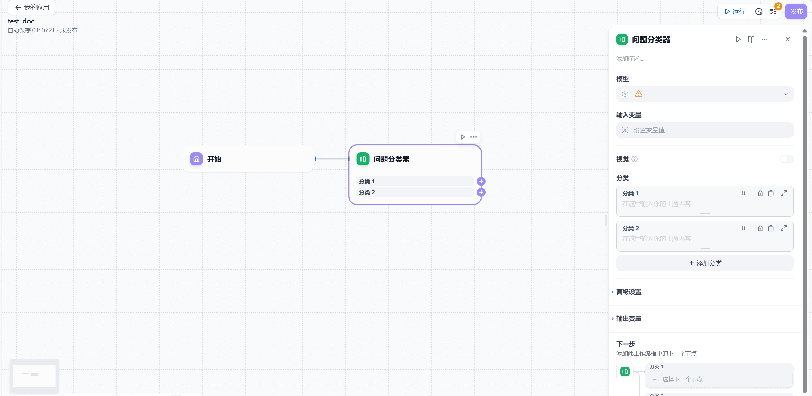
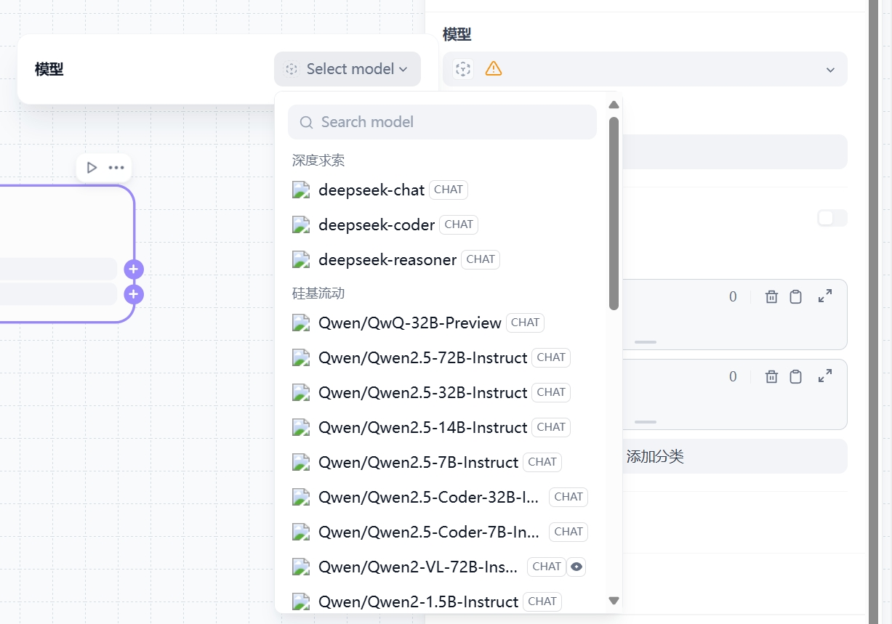

# 问题分类器

## 功能概述

问题分类器利用大语言模型(LLM)的智能推理能力，通过预定义的分类描述，自动将用户输入内容匹配到最合适的分类，为后续处理节点提供精准的分类依据。

## 配置说明

### 基础配置步骤

1. **选择输入变量**
    
   - 指定需要分类的内容来源，支持文本变量或文件变量
   - 客服场景建议使用 `sys.query` 获取用户问题

2. **选择推理模型**
    
   - 根据业务需求选择合适的大语言模型
   - 模型性能直接影响分类准确度

3. **定义分类标准**
    
   - 添加多个分类标签及详细描述
   - 清晰的描述可提升模型识别精度

4. **设置下游节点**
    
   - 配置分类结果与后续处理节点的对应关系
   - 建立完整的工作流程链

### 高级配置选项

- **自定义指令**  
    提示词编写功能：
  - 系统/用户/助手角色提示词定义
  - 提示词生成器辅助创作
  - 变量插入功能（"/"或"{"触发）
  
  

  
## 输出变量说明

分类结果将存储在 `class_name` 变量中，包含预测的类别标签。后续节点可通过引用该变量实现分类导向的差异化处理。