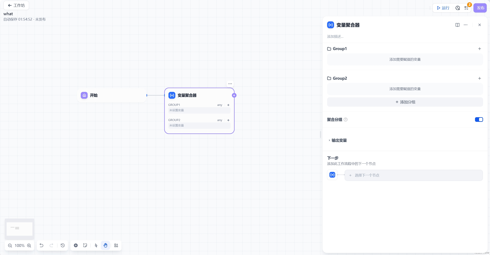

# 变量聚合

## 功能概述

变量聚合节点（原变量赋值节点）是GoAgent工作流中的核心组件，用于将多分支输出统一整合为单一变量。通过该功能，您可以：

- 合并不同分支的同类型输出
- 简化下游节点的变量引用
- 避免重复配置相同功能的节点

> **典型应用场景**：问题分类处理、条件分支合并、多路输出归一化

### 数据类型支持
支持聚合以下数据类型：
- 字符串（`String`）
- 数字（`Number`）
- 文件（`File`）
- 对象（`Object`）
- 数组（`Array`）

### 使用限制
1. **类型一致性原则**：单组内所有聚合变量必须是相同数据类型（由第一个添加的变量类型决定）
2. **分组功能**：启用"聚合分组"后可同时维护多组变量集合，每组独立遵守类型一致性原则

## 最佳实践建议
- 在分支节点后立即添加变量聚合节点
- 为聚合变量设置具有业务意义的名称
- 复杂场景建议启用分组功能保持逻辑清晰
